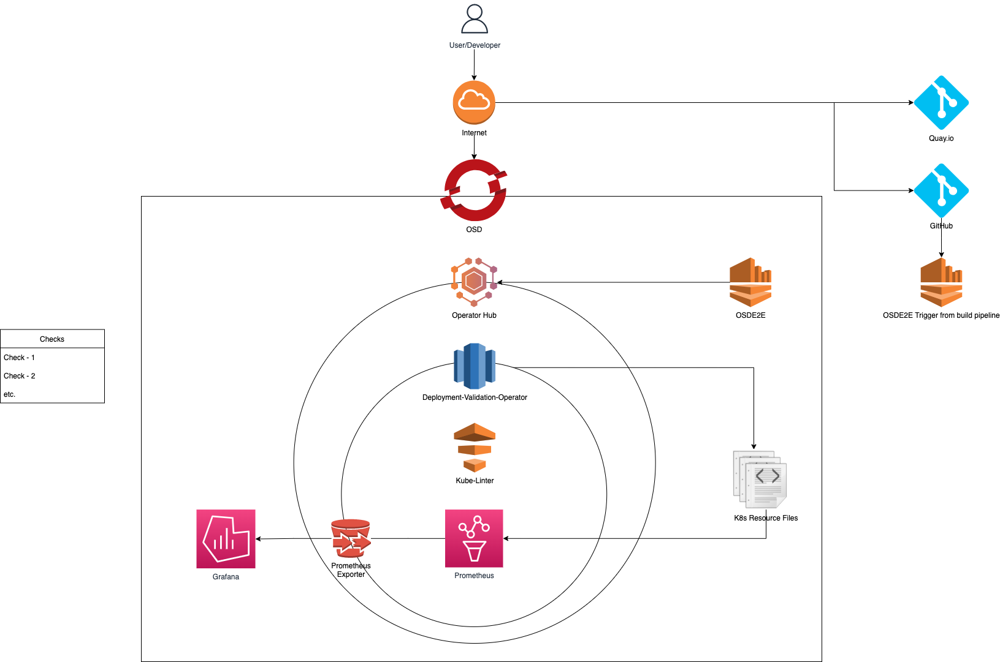
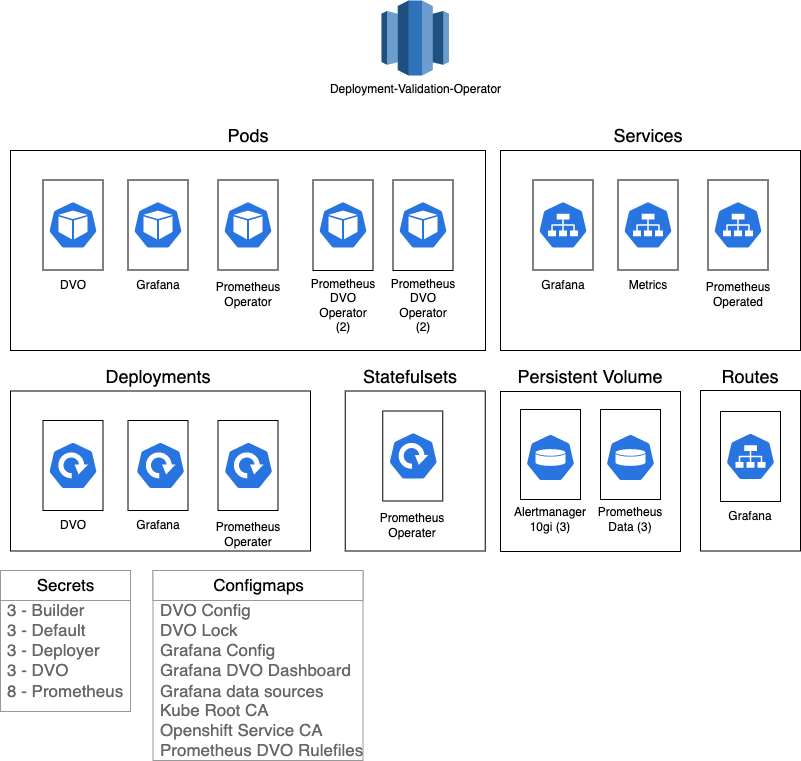

This is a diagram of the high level overview of the DVO Architecture. This diagram shows the view from the `OSD` level. It shows the lifecycle of how DVO is deployed onto the `OSD` from Operator Hub (via fetching image from Quay.io) and then how it interacts with K8s resources and outputs metrics based on the resource. It also displays the checks that are enabled. Lastly it shows the osde2e interacting for the testing suite.

This is a diagram of the low level overview of the DVO Architecture. This diagram shows the view from the `OC` level. The Deployment will launch `3` pods (DVO, Grafana, and a prometheus operator for metrics). The statefulset will launch another set of pods to support the prometheus operator. The services/routes , volumes, secrets, and configmaps are also shown. 
