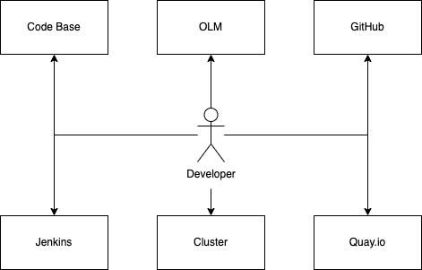
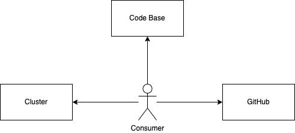
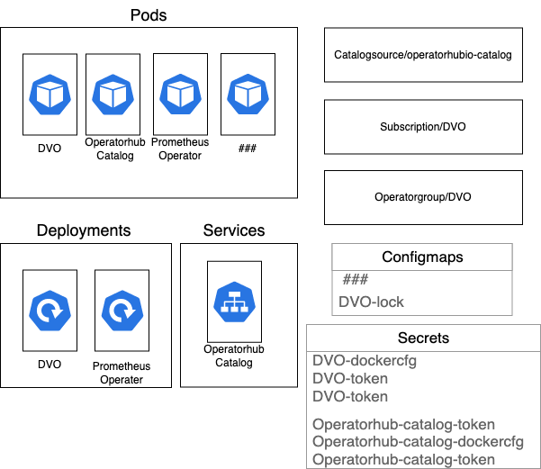
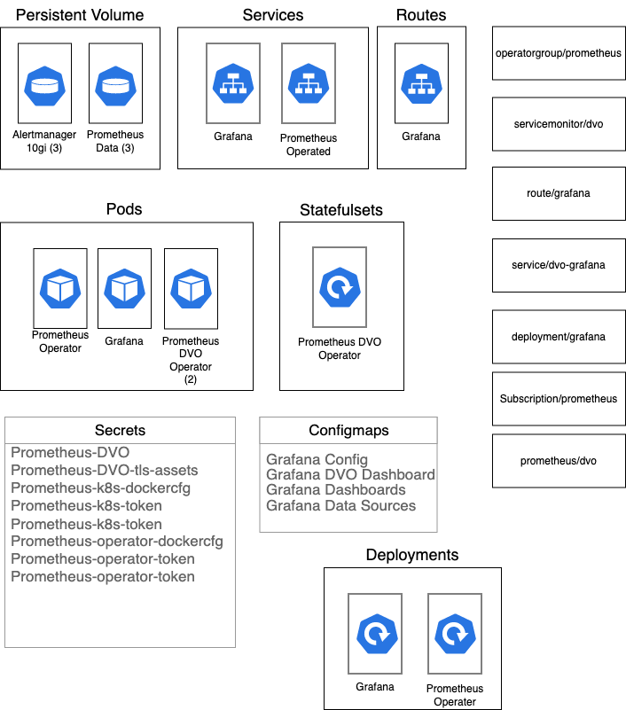
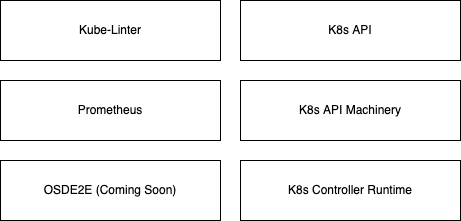

Code Base: A developer interacts with the code base to add features, create new releases, create unit tests, modify files 

GitHub: Submits PRs to DVO Repository, approve/reject PRs

Jenkins: Verifies the DVO build job has kicked off during new release process

Quay.io: Verifies the newly created DVO image exists in the corresponding repository

OLM: Submits PR during DVO release process so versioning matches with new DVO image

Cluster: Utilizes/Verifies changes work by deploying DVO to an OSD cluster and executing appropriate actions to test the change in functionality

Code Base: A consumer interacts with the code base perform a manual/OLM installaion of DVO 

GitHub: A consumer will view the README to understand how they deploy DVO successfully either manually or via OLM

Cluster: A consumer will need a cluster to deploy DVO to and interact with (future tense will be able to deploy via catalog)

This diagram represents the resources deployed in a DVO Operator Managed Deployment. When a user deploys DVO via OLM this diagram shows the components that are created when connecting to the OLM catalog and deploying the operator. This configuration comes up with a subscription to operaterhub to check for upgrades (default 24h). 

This diagram represents the resources deployed in a DVO Observability Deployment. All of the components listed here make up what is needed to setup the Prometheus/Grafana parts of DVO. This setup allows for monitoring DVO for validation checks on resources and reporting when a validation check fails in an easily consumed format.

K8s API - allows for DVO to interact with Kube/Openshift objects

K8s Controller Runtime - Enables DVO to utilzie the reconciliation loop to constantly be checking for new K8s resources to validate

Kube-linter - provides standard templates for upstream validation checks

Prometheus - Provides metrics if a validation check has failed 

OSDE2E - Provides end-to-end test framework and automated testing
